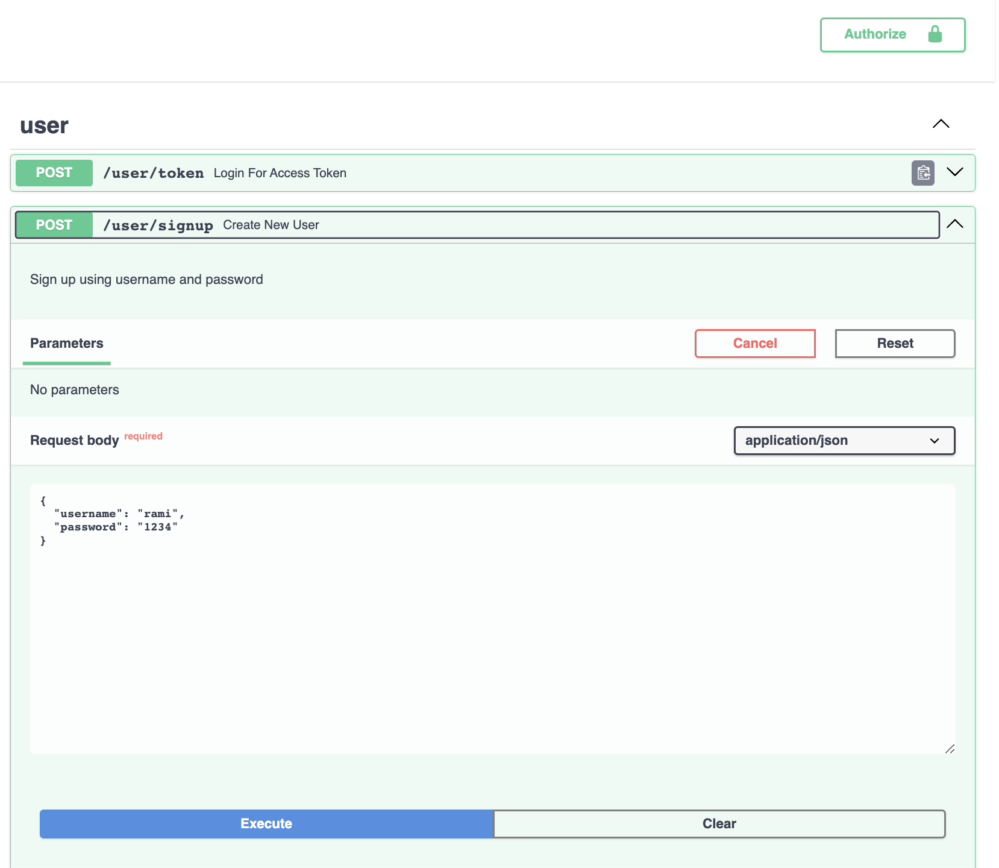
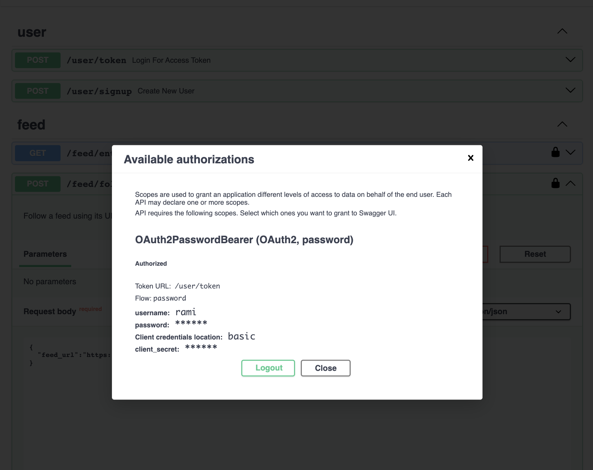
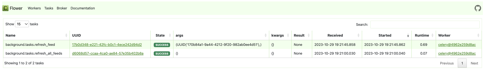

# RSS Feed Service 👨🏻‍💻

This service provides an API to manage RSS feeds and a background process to update them. Open this file in a markdown viewer if you want to see the images!

### General

- Using FastAPI 😎 for the API

- Using Celery 🌱 with Beat 🥁 for t
  he background tasks and scheduling, Redis for locks

- Using PostgreSQL for the database

- Using SQLModel for the ORM (still in alpha and lacking docs, but I wanted to try it out as I've never touched SQLAlchemy! Downside is async features not documented yet so couldn't use those, and documentation split between sqlmodel and sqlalchemy)

### Running the service

To run the service, you need to have docker and docker-compose installed.

[Install Docker](https://docs.docker.com/engine/install/)

[Install Docker-Compose](https://docs.docker.com/compose/install/)

Then you can run `docker-compose up` to start the service. This will start the API, the Celery workers, the Celery beat scheduler, the Redis broker and Postgres database. Pretty impressive for a single command 🤓!

### Interacting with the API

To actually use the service after you get it running, navigate to [http://localhost:8000/docs](http://localhost:8000/docs) to see the Swagger UI. You can use this to interact with the API and see the available endpoints, models, etc.

You first have to create a username and password (signup endpoint), and then you can use the big green AUTHORIZE button on the top right of the page.

When you authorize, you'll be prompted for a username and password. Use the ones you just created and you'll be able to use the secured endpoints.

### Quick API Journey

➡️ After signing up, try following a feed, for example:
https://feeds.feedburner.com/tweakers/mixed
https://feeds.bbci.co.uk/news/world/rss.xml
https://www.nu.nl/rss/Algemeen

➡️ Then try listing all the feed entries for a feed using the list endpoint. Notice all the filters you can use on this endpoint! Let's create some data to filter on first though.

➡️ Try marking a post as 'read' using the mark endpoint!

➡️ Try unfollowing one of the feeds that you followed. Note that you have to get the feed_id from the list endpoint first.

➡️ Try listing all the feed entries for a feed again while filtering for read posts only. You should see the post you just marked as read!

➡️ Try filtering by followed feeds only. You should see posts from the feed you just unfollowed disappear!

➡️ If a feed every fails to update or you just want to force an update now, you can use the force refresh endpoint with the feed_id. This will trigger an update instantly. You probably don't have to do this often as the scheduler will update your feeds every 5 minutes!

## Design Decisions

### RSS Feed Parsing

- It seems like RSS feeds have some common elements [RSS Common Elements](https://pythonhosted.org/feedparser/common-rss-elements.html).

  I decided to extract those elements into database columns, while also storing the raw results as json in the database. This would be the approach I would take for an MVP that satisfies all the requirements, but still allows for accessing and denormalizing additional elements in the future if needed as I already store the raw data and storage is inexpensive.

  I _could_ simply store everything as JSON and index the fields I want to search on, but I think it's better to have the main subset of the data in a normalized form for faster, cheaper and nicer access and querying.

- I decided to store ALL RSS feed items in the database, even if they are no longer live.

  This allows me to keep a history of all items and also allows me to keep track of which items a user has read, starred, etc. I can easily keep track of the "live" items by adding an `is_live` column to the FeedEntry model and filtering on that if needed. (To elaborate: all posts would be live in the beginning - on every update, set all is_live to False, then update the received items to True as well as on the created items by default. This way we minimize the number of changes we have to do, and they can be done in bulk.)

- I also support syncing updates to historical RSS items (even if publication date doesn't change, can't hide your changes from me 😎😉). This is done by hashing the entire content of a Feed and of a FeedEntry and comparing them to the previous hash 👨🏻‍💻. If they are different, update. Otherwise no changes detected, no need to update anything!

### Data Model

We have a User model, a Feed model, and a FeedEntry model.

To link `feeds` to `users` (follow/unfollow), I created a `FeedUser` model (link/jump table). This would allow me to track which feeds a user is following.

To link `feed entries` to `users`, I created a `FeedEntryUser` model (link/jump table). This would allow me to track which entries a user has read, starred, etc.

#### Alternatives considered for this specific model:

- ❌ Store one `FeedEntry` _per user_ and add a column for read/starred/etc. This would be a lot of data duplication (posts duplicated 1x per user since user can also read posts from 'unfollowed' feeds currently)
- ❌ Store one `FeedEntryUser` _per post_ and add a column for read/starred/etc. This would result in number_of_feed_entries x number_of_users rows in the database.
- ✅ Store one `FeedEntryUser` whenever user reads/starred/etc. This would result in the fewest amount of rows, since the upper bound of this is the previously proposed solution. This also allows enough flexibility to achieve all the requirements and more.

### Backend

- API decision were made assuming there will be a frontend consuming this API.

- For the `follow` enpoint, I decided to use RSS feed urls as input for the follow (as that's what the user will probably have). The alternative is having a `feed/create` endpoint that will return a feed id that can then be used to follow the feed. I decided against this as it would require an additional request to the API and I don't see a reason to do that given the requirements.

- For the `unfollow` endpoint I decided to use the feed id as input for the unfollow (as that's what the user will get after following a feed and this is what they will have on the results of the list endpoint). The unfollow will probably take place from a view of the listed followed feeds, so it is natural to assume the frontend will have their IDs. Might break the 'standard' of using the feed url as input, but I think it's a reasonable tradeoff.

- Ignored timezone information for simplicity

- Run every route in a transaction and only commit at the 🔚 of the route. This is a tradeoff as it will hold the connection for longer, but it will also make sure that if anything fails, the database will be in a consistent state and partial updates will not be persisted. Better have it in the route and not service functions as then we can rollback the work of several service function calls if any errors are encountered 🤓!

- Added JWT authentication with a signup endpoint and a token endpoint

- Where possible, minimize complexity. If I can get away with only passing user_id to a service-level function, then I will do that. If I don't need the entire user instance then no need to send it. This makes testing service level functions easier as they are more isolated and don't need to worry about the entire object graph.

- For error handling, I chose a specific JSON format for validation/internalserver errors so that they can be easily consumed, indexed, and searched by an APM. Future work: Capture the errors thrown by celery workers and beat in the same format. Right now just throwing exceptions and didn't want to spend more time on it.

### Task Processing

- Using Celery with Beat for the background tasks and scheduling with custom delay countdowns of 2mins, 5mins, and 8mins

- Using Redis as the broker and backend - do not care much about persistence and also easiest to setup

- Improvement: Current delays are very static and risk encountering thundering herd problem. Can easily add jitter with Celery by adding a class property to the custom task class [Thundering Herd](https://en.wikipedia.org/wiki/Thundering_herd_problem)

- Task uniqueness: In case of a failure, the task will be retried, but many duplicates might be created. To avoid this, we acquire a lock whenever a task is scheduled / retrying. When it succeeds/fails/exceeds retry limit, we release the lock. This prevents duplicate tasks.

- You can monitor tasks by navigating to [http://localhost:5555](http://localhost:5555) (flower)
  

### Scalability

- First thing we'd want to do is add a load balancer in front of the api. This would allow us to scale out the api horizontally, rate limit it, etc. We can use Traefik, Nginx, or some built-in LB in AWS, etc.

- At some point, the workers might strain the DB too much if we get a ton of feeds and feed entries (reading individual feed entries before updating them), then we can add read replicas to relieve the pressure.

- Then at another point far after that, we might be writing too much to the database (adding a ton of feed entries very frequently) and writing becomes a bottleneck. Then we can either throttle the writes (queue in front of db or something) or scale up the database (bigger instance, more IOPS, etc) or scale out the database (sharding, etc).

- If we get a ton of users reading a lot, we could add a cache in front of the database to provide fast access to the most recent feed entries. This would be a tradeoff as we would have to update the cache on every update, but it would be worth it if we get a lot of reads. Users usually only want the most recent entries and our filtering is pretty simple, so filtering on the cache would also be easy.

### Packaging

- Left logging level on info for containers (easier to understand what's going on since this is an educational project)

- Mounted the code as volumes to the docker containers (in docker-compose) so that we can make changes in the code and see them reflected immediately without having to rebuild the containers.

- Lint Dockerfiles with Hadolint

- Scan image and code with [Trivy](https://github.com/aquasecurity/trivy) for vulnerabilities - patched critical ones in Dockerfile.

- Split the Poetry dependencies into base and dev dependencies so that we don't have to install dev dependencies in production. Dev dependencies include pytest, stubs for mypy, etc.

- Split the Dockerfile into several stages to separate the test image from the production image. This allows us to only install the base dependencies in the production image and not the dev dependencies.

### Commands:

- Build docker container:

  `docker built -t rssfeed .` or using compose

- Scanning code with Trivy:

  `trivy fs --scanners vuln,secret,config ./`

- Scanning image with Trivy:

  `trivy image rssfeed`

## Development Setup

To run this project locally, you need to have Python 3.11 installed.

- Install poetry, then run `poetry install && poetry shell` to install deps and activate the virtual environment.
- Run Redis and Postgres in the background, and create a DB called rssfeed in postgres.
- Configure the .env file to contain REDIS and Postgres connection strings. Upon running the app you'll see errors that prevent it from running if the .env config is not correct, so you'll know how to fix!
- To run the tests, run `pytest` in the root of the project.
- To run the web server, run `uvicorn api.main:app --reload --port=8000` in the root of the project.
- To run the celery workers, run `celery -A background.tasks worker --loglevel=info` in the root of the project.
- To run the celery beat scheduler, run `celery -A background.tasks beat --loglevel=info` in the root of the project.
- To run celery's flower monitor, run `celery -A background.tasks flower --loglevel=info` in the root of the project.
